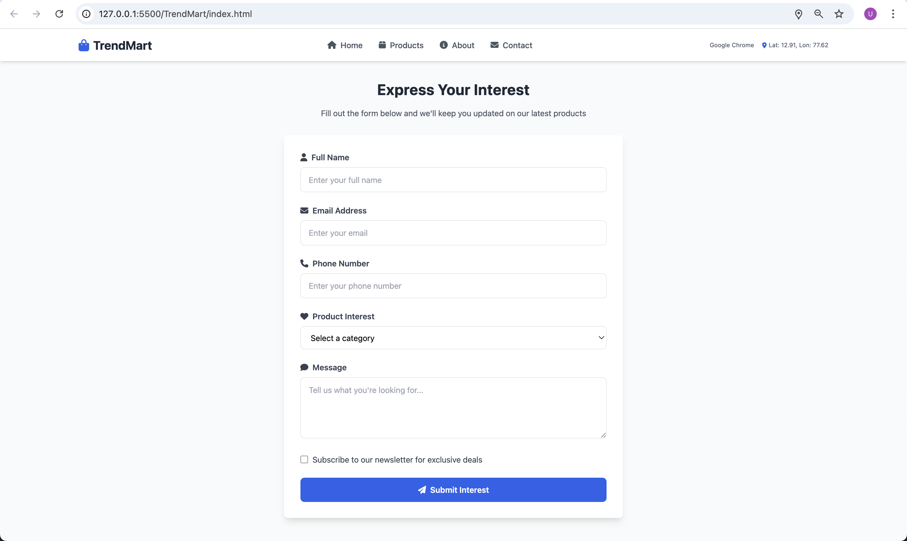
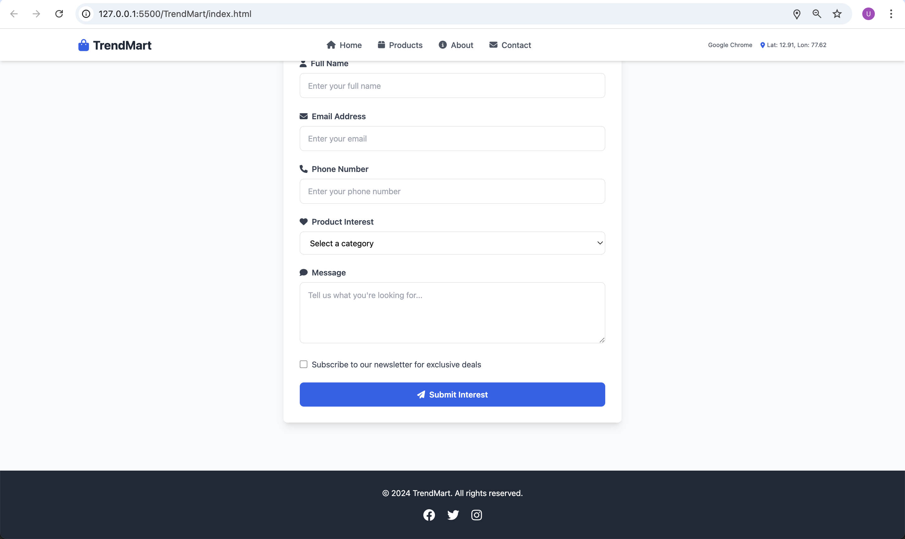

# TrendMart Product Explorer

- **Name:** Uddipan Dey
- **Registration No:** 25045008
- **Course:** Full Stack Development (MAI-OL-423-1)
- **Program:** M.Sc AIML Online - Semester I
- **Assignment:** CIA-1 – October 2025

## About the Project

This is a product browsing website called TrendMart where users can view trending products and search through them.

## Features

- Product listing fetched from API
- Search functionality to filter products
- Video and audio content
- Responsive design using Tailwind CSS

## Technologies Used

- HTML5
- Tailwind CSS
- JavaScript
- Font Awesome icons

## API Used

Products are fetched from: https://api.escuelajs.co/api/v1/products

## How to Run

open the `index.html` file in any web browser.

## Preview

### Homepage

### Product Listing

### Interest Form

### Footer

---

**Christ University**
